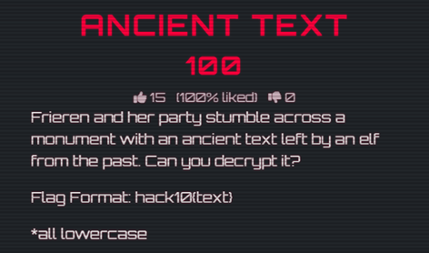
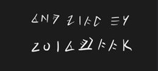
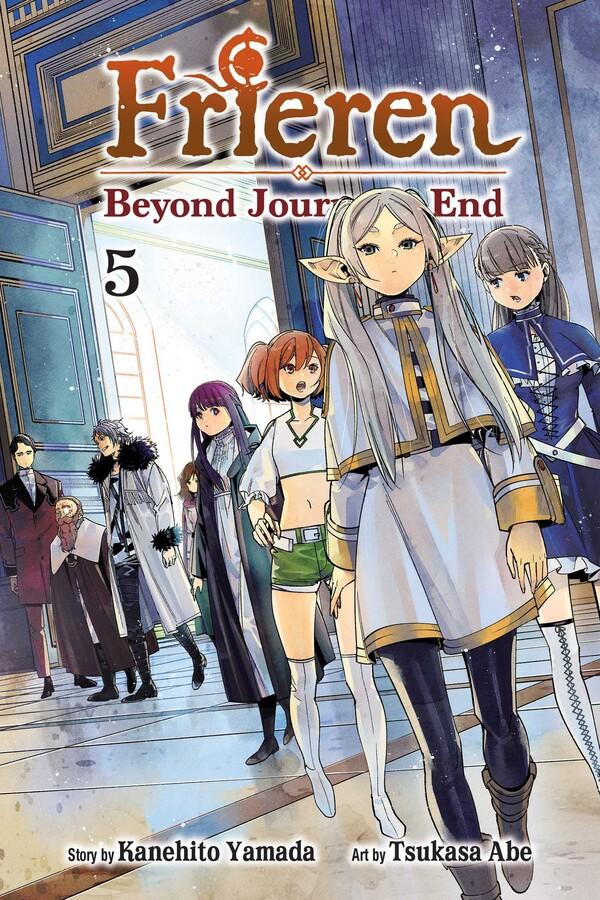
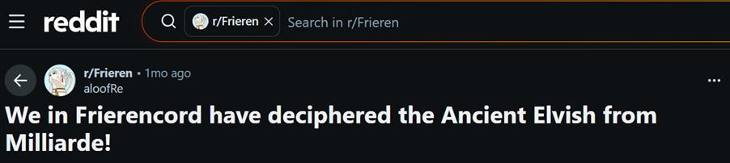
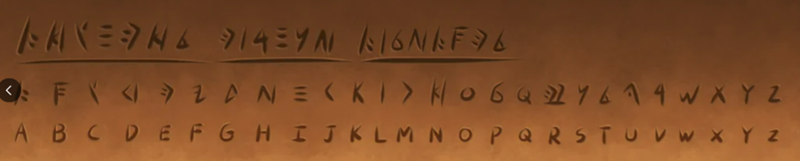

# 📜 Ancient Text — Writeup (Crypto / OSINT)

---

## Flag
```
hack10{zoltraak}
```

---

## Challenge Overview



We are given an image containing strange, unfamiliar symbols.



At first glance:
- No clear ciphertext format  
- No encryption algorithm provided  
- No obvious encoding (Base64, Caesar, etc.)

This suggests the challenge is **not traditional cryptography**, but rather:

> Recognition and external knowledge (OSINT)

---

## Initial Observation

The strongest clue in the challenge is the name:

> **"Frieren"**

This is a key hint pointing toward: **Frieren: Beyond Journey’s End (Sousou no Frieren)**



---

## Analysis Strategy

Instead of treating the symbols as a random cipher, the better approach is:

> What if this is an existing fictional language or symbol system?

So the focus shifted from:
- Breaking encryption  
➡️ to  
- Identifying the source of the symbols  

---

## OSINT Phase

I searched for:
```
frieren ancient text symbols
```

This led to a relevant Reddit discussion:



👉 https://www.reddit.com/r/Frieren/comments/1r4mrd3/we_in_frierencord_have_deciphered_the_ancient/

The post provided a **mapping of the symbols to real characters**.



---

## Decoding Process

Steps:
1. Compare the challenge symbols with the mapping  
2. Translate symbol by symbol  
3. Construct the plaintext  

---

## Result

The decoded word:

```
the flag is zoltraak
```

Final flag:

```
hack10{zoltraak}
```

---

## 🧩 Key Takeaways

- Not all crypto challenges require mathematical techniques  
- Recognizing context clues is critical  
- OSINT can be more powerful than brute force  
- Always consider pop culture or known references in CTF challenges  

---

## Tools Used

- Google Search (OSINT)  
- Reddit (community-sourced decoding)  
- Manual pattern matching  

---

## Skills Developed

- OSINT (Open-Source Intelligence)  
- Pattern recognition  
- Context-based problem solving  
- Research and information validation  
- Analytical thinking  

---

⭐ *This challenge highlights the importance of thinking beyond traditional cryptography and leveraging external knowledge sources.*
