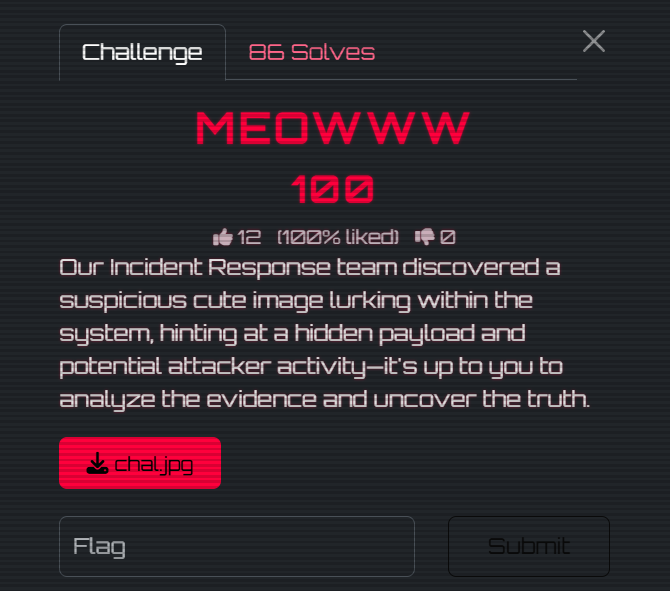
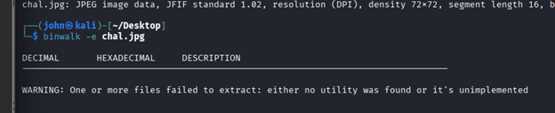
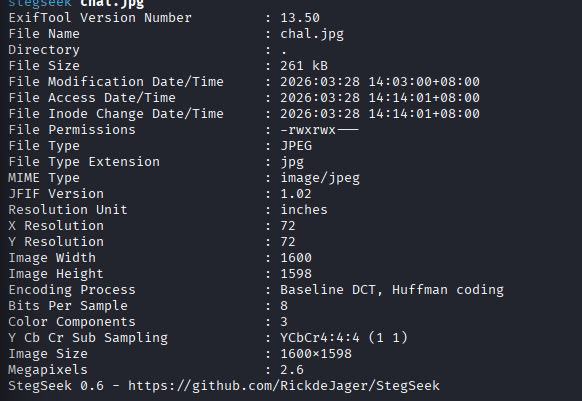
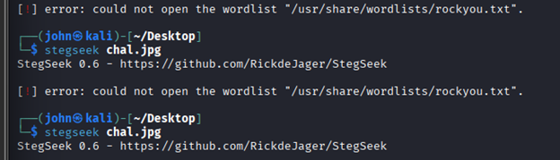
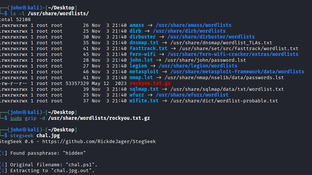
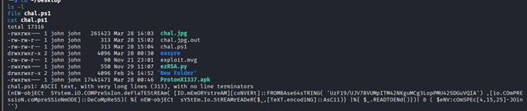
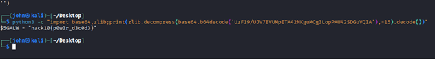

# 🐱 MEOWWW - Forensics Challenge Writeup

## Challenge Overview



The Incident Response team discovered a suspicious but harmless-looking image inside a system. The objective was to analyze the image, uncover hidden content, and recover the flag.

- **Category:** Forensics  
- **File Provided:** `chal.jpg`

.jpg)

- **Hint:** Hidden payload inside an image  

At first glance, the file appeared to be a normal JPEG image of a cat, suggesting the use of **steganography**.

---

## Initial Analysis

### 1. File Identification
```bash
file chal.jpg
```

**Output:**
```bash
chal.jpg:
JPEG image data,
JFIF standard 1.02,
resolution (DPI),
density 72x72,
segment length 16,
baseline,
precision 8,
1600x1598,
components 3
```

✅ Confirmed the file is a standard JPEG image.

---

### 2. Check for Embedded Files
```bash
binwalk -e chal.jpg
```


❌ No embedded files or appended data found.

➡️ This indicates:
- The payload is **not appended**
- It is likely **hidden within the image itself**

---

### 3. Metadata Analysis
```bash
exiftool chal.jpg
```



❌ No suspicious metadata or hidden strings found.

---

## Steganography Analysis

### 4. Using Stegseek
```bash
stegseek chal.jpg
```



⚠️ Issue encountered:
- `rockyou.txt` was compressed (`.gz`)

### Fix:
```bash
gunzip /usr/share/wordlists/rockyou.txt.gz
```

Then rerun:
```bash
stegseek chal.jpg
```



✅ **Success!**

Findings:
- Hidden data exists inside the image  
- Passphrase was recovered  
- Hidden file identified: `chal.ps1`  

---

### 5. Extract Hidden File
```bash
steghide extract -sf chal.jpg
```

- First attempt failed due to incorrect passphrase  
- Second attempt succeeded  

✅ Extracted file:
```bash
chal.ps1
```

---

## Payload Analysis

### 6. Inspect Extracted File
```bash
cat chal.ps1
```


The file contains an **obfuscated PowerShell script**:
- Base64 encoded  
- Compressed using Deflate  
- Dynamically executed  

---

### 7. Decode Payload Safely
```bash
python3 -c "import base64,zlib;print(zlib.decompress(base64.b64decode('UzF19/UJV7BVUMpITM42NKguMCg3LopPMU42SDGuVQIA'),-15).decode())"
```


---

## Final Flag
```bash
hack10{p0w3r_d3c0d3}
```

---

## Tools Used
- file  
- binwalk  
- exiftool  
- stegseek  
- steghide  
- python (base64 + zlib)  

---

## Skills Practiced
- Digital Forensics  
- Steganography Analysis  
- Payload Deobfuscation  
- Safe Malware Analysis  

---

## Key Takeaways
- Hidden data is not always appended to files  
- Steganography hides data within file structures  
- Proper tooling is essential for uncovering hidden payloads  
- Always analyze extracted payloads safely  
