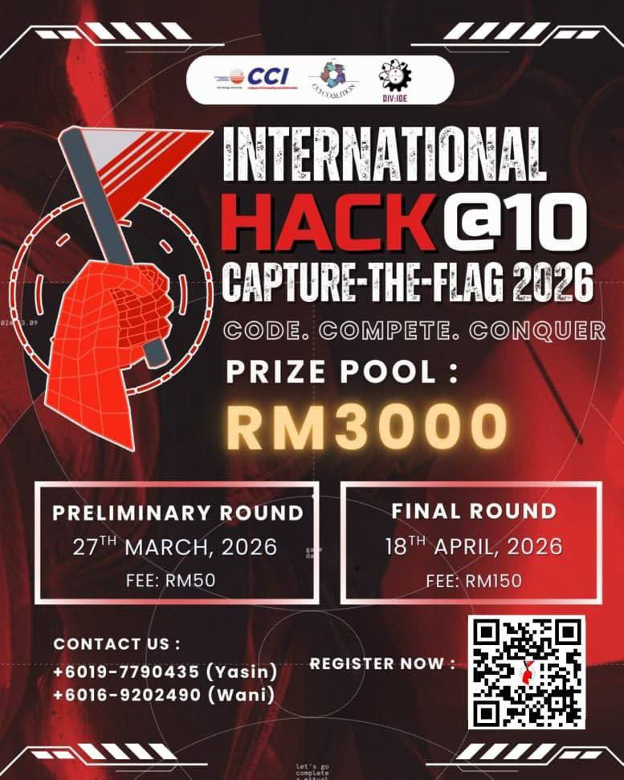
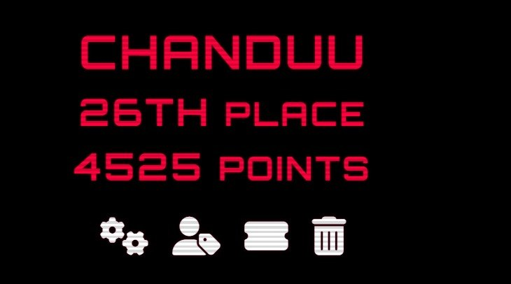
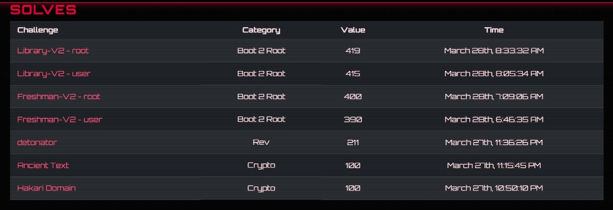

# 🏆 International Hack@10 Capture The Flag 2025 (Prelim)

---

---

## 📌 Overview

The **International Hack@10 Capture The Flag 2025 (Prelim)** is a cybersecurity competition organized by **Clicq UNITEN**, focusing on real-world security challenges across multiple domains.

**Date:** 27 March 2026  
**Platform:** https://hackaten.com/

This repository contains write-ups of challenges solved during the competition, covering areas such as:

- Boot-to-Root  
- Cryptography  
- Forensics  
- Reverse Engineering  
- Web Exploitation
- Misc

---

## 👥 Team Information

### **Team Name**: Chanduu  

### Team Members:
- **Muhammad Fahmi Bin Abd Salim** @ **Pawmee**
  🔗 https://www.linkedin.com/in/muhammad-fahmi-abd-salim-b5a12928b  

- **Muhammad Arshad Bin Sathar Mohamed**  @ **John**
  🔗 https://www.linkedin.com/in/muhammad-arshad-sathar-mohamed-434624352  

- **Wan Muhammad Uqbah Bin Wan Azhar** @ **Paul**
  🔗 https://www.linkedin.com/in/wan-uqbah-6326b6394  

---

## 📊 Performance

### 🏁 Team Performance
- 🏆 **Rank:** 26  
- 🎯 **Total Score:** 4516  
- 🧩 **Challenges Solved:** 16  

---

### 👤 Individual Contribution (Pawmee)

- 🎯 **Focused Domains:**  
  - Boot-to-Root  
  - Cryptography  
  - Forensics  

- 🧩 **Challenges Solved:** 7

- 💯 **Score Contribution:** 2035  

---

## 🧠 Key Learning Outcomes

- Applied real-world exploitation techniques in Boot-to-Root scenarios  
- Strengthened cryptographic attack analysis and implementation  
- Performed static malware and document analysis  
- Developed reverse engineering skills across binaries and APKs  
- Improved problem-solving under time-constrained environments  

---

## 🚀 Notes

- All write-ups are for **educational purposes only**  
- Challenges were solved during the competition or post-CTF analysis  
- Some write-ups may include simplified explanations for clarity  

---

⭐ *This repository reflects hands-on experience in cybersecurity challenges and continuous learning through CTF competitions.*
