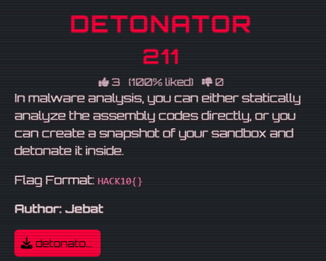
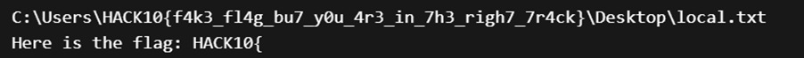
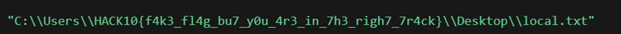

# 💣 Detonator — Writeup (Reverse Engineering)

---

## Flag
```
hack10{be029cf0e9f2eaa5f80489343630befb}
```

---

## Challenge Overview



We are given a Windows executable:

```
detonator.exe
```

### Objective:
Analyze the binary to determine how the flag is generated.

---

## Initial Analysis

Two main approaches were considered:

- **Static Analysis** (strings, disassembly, decompilation)
- **Dynamic Analysis** (execution in sandbox)

---

## Step 1: Basic Inspection

Using tools like `strings`, we immediately notice something suspicious:



### Observation:
- The embedded flag appears too obvious
- Likely a **decoy (fake flag)**

---

## Step 2: Static Analysis (Ghidra / IDA)

Opening the binary in a reverse engineering tool reveals:

### Hardcoded Path

The program constructs a specific file path internally.

Then it checks:

```c
if (file_exists(path)) {
    // continue execution
}
```

---

## Key Behavior

If the file exists:

1. The program computes the **MD5 hash** of the full file path string  
2. The result is printed as the flag  

---

## Understanding the Trick

- The visible flag in `strings` is **not the real flag**
- It is only used as part of a **file path**
- The real flag is derived dynamically:

> 

---

## Exploitation

### Step 1: Extract the Full Path

From static analysis, identify the exact hardcoded path used by the program.


---

### Step 2: Compute MD5

Using Python:

```python
import hashlib

path = "C:\Users\HACK10{f4k3_fl4g_bu7-y0u-4r3_in_7h3_righ7_7r4ck}\Desktop\local.txt"
md5 = hashlib.md5(path.encode()).hexdigest()
print(md5)
```

---

### Step 3: Construct Flag

```
HACK10{be029cf0e9f2eaa5f80489343630befb}
```

---

## Final Result

```
hack10{be029cf0e9f2eaa5f80489343630befb}
```

---

## Key Takeaways

- Strings in binaries can be misleading (decoy flags)  
- Static analysis reveals real program logic  
- File existence checks can control execution paths  
- Hashing operations may be used to derive hidden values  

---

## Tools Used

- `strings`  
- Ghidra / IDA  
- Python (`hashlib`)  
- Basic static analysis techniques  

---

## Skills Developed

- Reverse engineering fundamentals  
- Static binary analysis  
- Identifying misleading artifacts (decoys)  
- Understanding program control flow  
- Reconstructing logic from compiled binaries  

---

⭐ *This challenge highlights how reverse engineering reveals hidden logic beyond what is immediately visible in a binary.*
