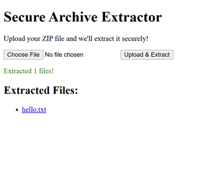
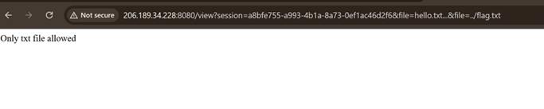
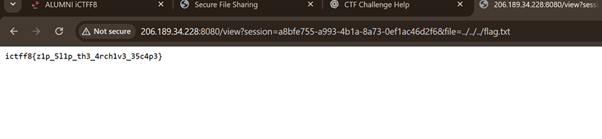

# 🧩 Challenge: Secure Archive Extractor


---

## Description

The application allows users to upload a **ZIP archive**, extracts its contents, and provides access to the extracted files via a link.

---

## Application Preview



---

## Initial Analysis

After uploading a ZIP file, the application generates a link like:

```text id="sec1"
/view?session=<uuid>&file=<filename>
```

This suggests:

* Files are stored in a **session-based directory**
* The `file` parameter is used to retrieve files

This immediately raises suspicion of:

> **Path Traversal vulnerability**

---

## Testing

A simple ZIP file containing `hello.txt` was created and uploaded.

Clicking the file resulted in:

```text id="sec2"
/view?session=abc123&file=hello.txt
```

---

## File Access Result



---

## Initial Attempt

Tried basic traversal:

```text id="sec3"
file=../flag.txt
```

### Result:

* ❌ Failed (likely due to filtering or insufficient traversal depth)

---

## Exploitation

After ensuring a valid session exists, deeper traversal was attempted.

### Payload

```text id="sec4"
file=../../../flag.txt
```

---

## Exploit Result



> *(Flag successfully retrieved)*

---

## Final Flag

```text id="secflag"
ictff8{z1p_51lp_th3_4rch1v3_35c4p3}
```

---

## Tools Used

* Web Browser
* ZIP utility

---

## Skills Developed

* Identifying path traversal vulnerabilities
* Exploiting file access via URL parameters
* Understanding file extraction mechanisms
* Bypassing directory restrictions

---

## Key Takeaways

* Always validate and sanitize file paths
* Never directly use user input for file access
* ZIP-based applications are prone to:

  * Path traversal
  * Zip Slip vulnerabilities
* Proper isolation of user files is critical

---
